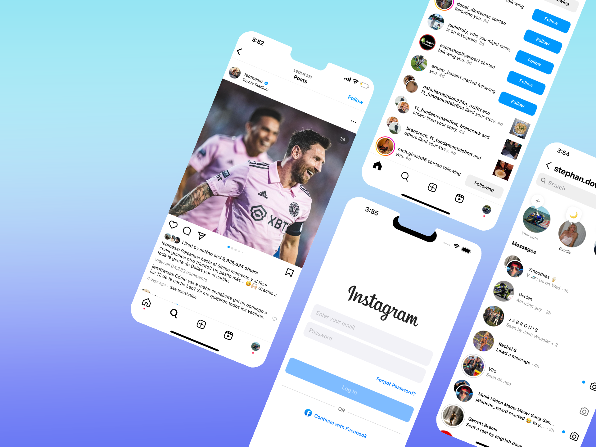
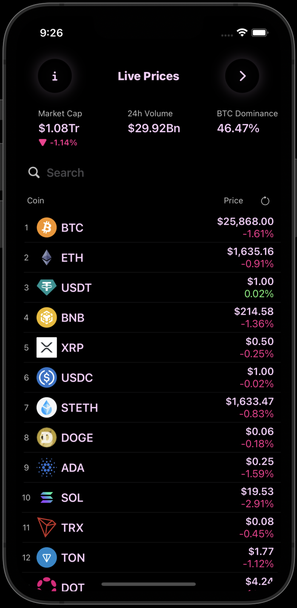

# This is my Portfolio

I'm an engineer who's found my groove in the world of software creation. 
I've got some experience in software development and a real hunger for learning.

# Instagram Clone

<a href="https://github.com/luisValdess/instagram-clone">🔗 Instagram Clone</a>
 
 
> - User Interface built completely with SwiftUI
> - MVVM Architecture pattern
> - Direct Messaging  
> - User Authentication with Firebase       
> - Pagination
> - Likes/Comments/Follows                  
> - In-App Notifications                 
> - Search for users
> - Server side functions for optimized performance

# Crypto App

<a href="https://github.com/luisValdess/CryptoApp">🔗 Crypto App</a>
 

> - 100% SwiftUI interface
> - MVVM Architecture
> - Core Data (saving current user's portfolio)
> - FileManager (saving images)
> - Combine (publishers and subscribers)       
> - Multiple API calls
> - Codable (decoding JSON data)                  
> - Multi-threading (using background threads)
> - Safe coding!!! ("if let" and "guard" statements to avoid crashes)

&nbsp;&nbsp;&nbsp;&nbsp;&nbsp;

